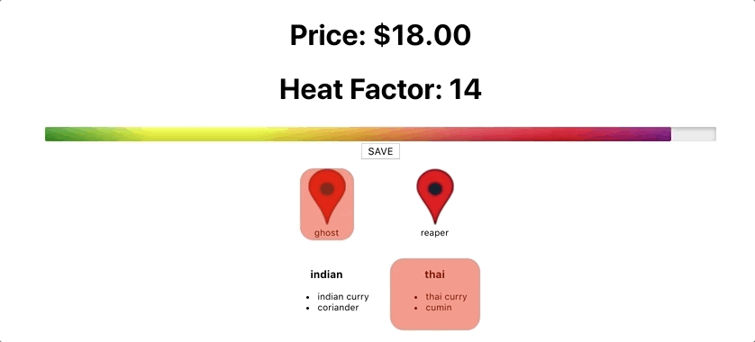

<h1>HeatMakers's Create Your Own Hot Sauce Site</h1>

The purpose of this website is to allow customers to create their own personalized hot-sauces in small batches.  From gifts, to parties, to restaruant tables, this is a great way for people to express their own taste in hot sauce.

Currently can select one item from each section, tally the "heat" and "price", and display data both as numbers and progress (heat) bar.  New recipe gets saved to database in recipe field.

# Progress Report
## Capabilities:
* Create items in firebase database
* Map data to render list items
* Select one item's data from each catagory
* Display total of faux heat
* Display total of faux pricing
* Progress bar
* Create and save recipe in database via firebase
* NavBar with Switch Routes set
* Add Save Module Prompt

## ToDo:
* Data
* clean CSS
* Select multiple items
* User Accounts
* Purchase steps
* Label Maker

## Future Goals:
* Admin capabilities